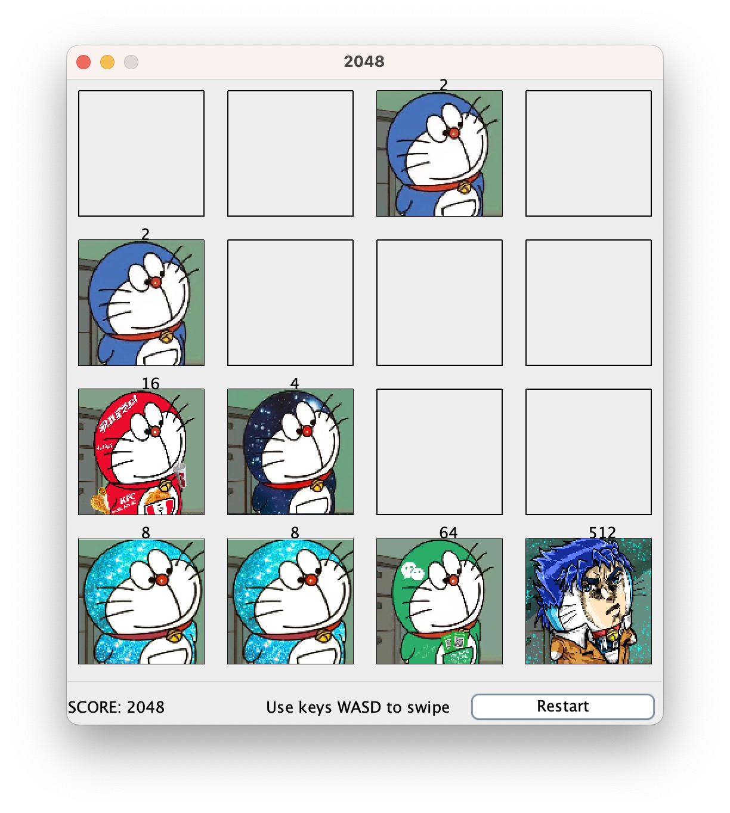

# Blue-Fatty 2048

<!-- Picture -->

## Introduction

***Blue-Fatty 2048*** is an engaging and strategic game where players merge tiles featuring **blue-fatties** to spawn new ones with elevated scores. The ultimate goal is to amass the highest score before the board becomes saturated and no further moves can be made.

## Usage

Ensure Java is installed on your device. If not, download Java [here](https://www.oracle.com/java/technologies/downloads/).

To play the game, clone the repository and execute the following commands:

```bash
$ javac game2048/Main.java
$ java game2048/Main.java 
```

Upon execution, the game interface will appear as shown below:



## How to play

- **Controls**: Use the W/A/S/D keys on your keyboard to move the tiles up, left, down, and right respectively.
- **Objective**: Combine tiles of the same value to create a tile with double that value. The game continues until there are no more possible moves.
- **Scoring**: When two tiles of the same value combine, they evolve into a higher tier tile and add to your score. The higher the tile value, the more points you earn.
- **Game Interface**: The bottom left of the screen displays your current score. On the bottom right, there's a button to restart the game. In between, you'll find game operation hints. When the game ends, a "Game Over" message will be displayed.

## Architecture and Design

The game's architecture primarily consists of three classes: Board, Grid, and Block.

### Block
- Represents individual tiles on the grid.
- Contains member variables exponent, value, and empty to represent the exponent, score value, and whether the tile is empty.
- On initialization, the tile is set to empty with exponent=0, value=1, and empty=true.
- The setExponent method updates the tile's value and empty status based on the exponent.

### Grid
- Inherits from JPanel and displays a 4x4 grid of tiles.
- Contains methods to set tiles, add new tiles, and handle swipe actions.
- On initialization, two random tiles are added to the grid.
- After each swipe action, the grid updates based on game rules and adds a new random tile.
- The grid checks for possible moves after each action. If no moves are available, the game ends.

### Board
- Inherits from JFrame and represents the main game interface.
- On initialization, the game score is set to 0 and the grid is initialized.
- KeyBindings are used to bind the W/A/S/D keys to the swipe actions on the grid.
- A restart button allows players to reset the game at any time.

## How to Contribute

If you'd like to contribute to the development of Blue-Fatty 2048, please fork the repository and submit a pull request.